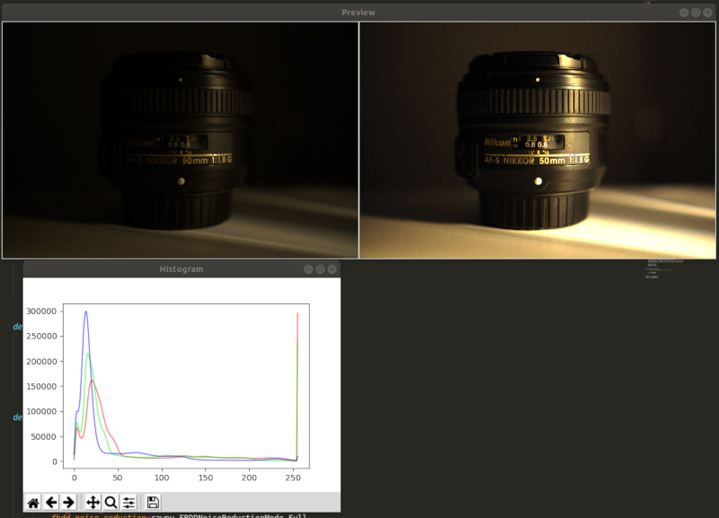

# Two Stop

This is a proof of concept image processor which uses a technique of sacrificing image resolution
for light/exposure. Two full stops of light can be gained (hence the name) at the cost of halving 
the resolution.

This could be helpful for astrophotography for example where saving 2 stops of light could mean the
diffence between a 30 sec exposure and a 2 min exposure.

Another use case could be to get very low noise images by shooting at ISO 100 and setting exposure 
compensation to -2 stops (or more if you boost in post).

## Screenshot



You can view the output sample file [here](images/test.jpg).

## Set Up

The best way to set this up is with a `virtualenv` and installing the dependencies like so:

```
$ virtualenv venv
$ source venve/bin/activate
$ pip3 install -r requirements.txt
```

## Example

This repo includes a sample NEF RAW file which was shot with exposure compensation set to -2 stops. You can run a 
test preview like so:

```
$ ./twostop.py preview images/test.nef
```

You can produce a JPG like so:

```
$ ./twostop.py process images/test.nef
```

## Usage

NOTE This only works with RAW images, this will not work with raster images (JPGs/PNGs etc.).

### Process

A RAW image file can be processed like so

```
$ ./twostop.py process images/test.nef images/test2.nef --expcomp=1.25
```

This will produce a JPG image at `images/test.jpg`.

#### Args

- `expcomp` - Exposure compensation. E.g. 0.25 = -2 stops, 8.0 = +3 stops

### Preview

Process a RAW image file and show a before/after preview + histogram.

```
$ ./twostop.py preview images/test.nef --expcomp=1.25
```

#### Args

- `file` - The RAW file to process and preview
- `expcomp` - Exposure compensation. E.g. 0.25 = -2 stops, 8.0 = +3 stops
